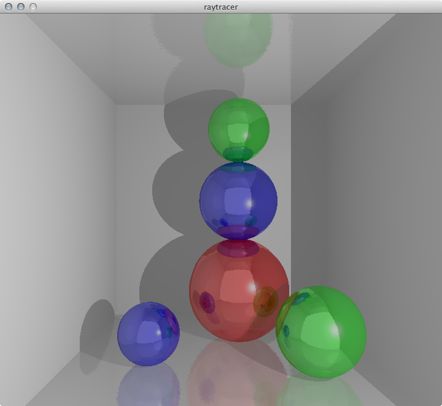
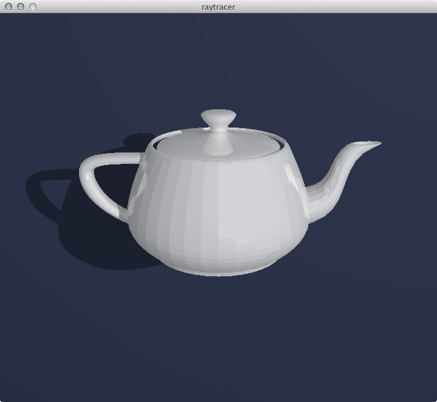

##About
A raytracer in C. It has shadows, reflections, lightning ([phong model](http://en.wikipedia.org/wiki/Phong_reflection_model)). It could be built with  [CSFML 2.0](http://www.sfml-dev.org/download.php) or libPNG.

##Usage
You could use included xcode project, or use a makefile located in raytracer directory. If you have CSFML 2.0 installed, then use ```make with_csfml```, otherwise use ```make with_libpng``` (use apt-get or brew or whatever to get libpng).
It has 3 hardcoded demos, you can edit scene.c to change them.

For instance:
```
./raytracer teapot
```  

Have fun.

##Screenshots
  
  

##License
[The MIT License (MIT)](http://opensource.org/licenses/mit-license.php)